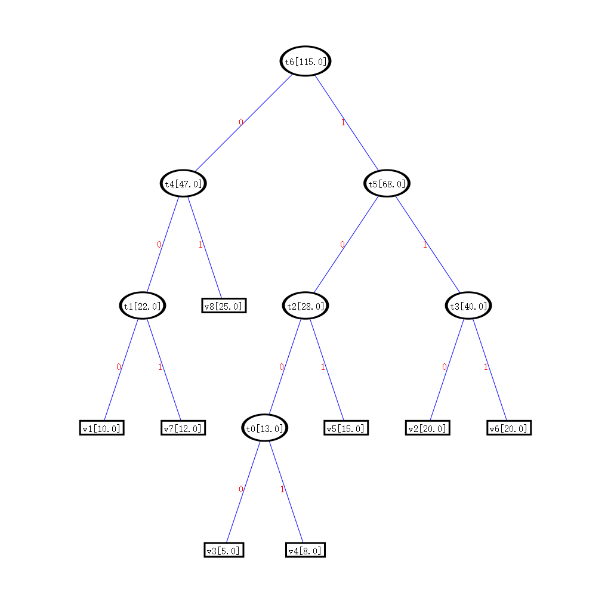

### 概述
一个图可视化布局的工具，目前实现了fruchterman reingold、kamada kawaii、yifanhu、sugiyama四种图可视化算法。

### 编译环境
visual studio 2022
ISO C++17 标准

### 运行
```
<execute file> <in.dot> <out.png> [options]
Options:
    -m <method>           算法选择：Fruchterman Reingold, Kamada Kawai, Yifan Hu, Sugiyama [fr|kk|yfh|sgym, default: sgym]
    -w <width>            生成的png图像宽度(pixels) [default: 1024]
    -h <height>           生成的png图像高度(pixels) [default: 760]
    -k <strength>         Strength factor [default: 10 for fr, 300 for kk]
    -i <nb_iterations>    Number of iterations for fr [default: 100]
    -e <epsilon>          Energy threshold for kk [default: 1e-2]
    -a                    Output all intermediary frames for fr [default: false]
    -s <step ratio>       Step ratio for yfh [default: 0.95]
    -l <max level>        Quad tree max level for yfh [default: 20]
    -b <barnes hut theta> Barnes hut theta for yfh [default: 1.2]
    -c <convergence threshold>    for yfh
```
例如：
``` sh
.\GraphLayout.exe .\samples\dotfile\Huffman7.dot .\samples\result\Huffman_sgym.png -w 1024 -h 1024 -m sgym
```

生成的图片如下：



### 各文件概述
1. **dot2png.cpp** 负责解析命令行，绘制最终生成的png图像等功能
2. **nodesoup.cpp** 提供了调用四种图布局算法的接口
3. **algebra.hpp** 定义了点类和向量类及其接口
4. **layout.hpp** 布局相关的函数，比如中心化函数
5. **kamada_kawai.hpp** kamada_kawai算法实现
6. **fruchterman_reingold.hpp** fruchterman_reingold算法实现
7. **yifanhu.hpp** yifanhu算法实现
8. **crossing.hpp** sugiyama算法-减少层间交叉算法
9. **cycle.hpp** sugiyama算法-去环增边算法
10. **layering.hpp** sugiyama算法-节点分层算法
11. **positioning.hpp** sugiyama算法-布局计算算法
12. **router.hpp** sugiyama算法-路径还原算法
13. **sugiyama.hpp** sugiyama算法实现
14. **cairo-.\*** windows环境下cairo库要自己编译，为了方便直接将dll文件和各头文件包括进来


### 参考
* https://github.com/olvb/nodesoup
* https://github.com/Kali-Hac/YifanHu_python
* https://github.com/gml4gtk/demekgraph
